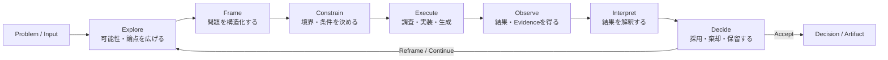
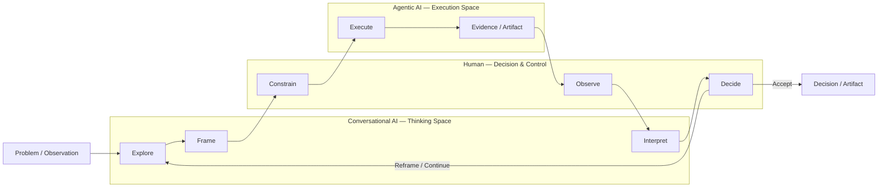
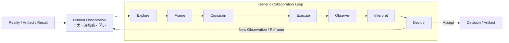
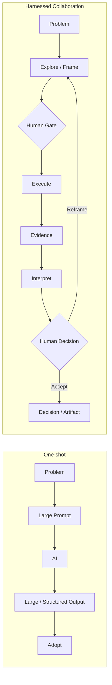

# Human × AI Collaboration Loop

### 探索・制約・実行・観測・解釈・判断の循環としての協働モデル

One-shotな回答生成からHarnessed Collaborationへ ― 製品非依存の概念モデル

---

## Abstract

生成AIは、短時間で大量かつ構造化された出力を生成できる。しかし、出力が多く、詳細で、論理的に構造化され、自信を持った文章として表現されていることは、その出力が十分なEvidence（根拠）に基づいていることを保証しない。さらに、複雑な問題を一度にAIへ入力して完成度の高い成果物を得ようとすると、AIが行った探索・仮定・実行・評価が一つの出力へ圧縮され、人間が介入すべき箇所が見えにくくなる。本稿は、Human × AI Collaborationを一度の `Prompt → Output` としてではなく、**Explore → Frame → Constrain → Execute → Observe → Interpret → Decide** の循環として捉える汎用モデル（Generic Loop）を提示する。次に、このLoopを製品名ではなく機能的なSpace ― Thinking Space、Decision & Control、Execution Space ― へ対応づけ、人間による現実の観測を起点とする派生形（Observation-led Collaboration）を示す。またLLMの冗長性補償（Verbosity Compensation）に関する研究を補助的背景として、出力の詳細さをEvidenceの強さとして扱わない原則を置く。最後に、本モデルとHuman × AI Harnessの関係を、協働の上位モデルとそれを制御するControl Layerとして整理する。中心となる主張は、**Well-formed Output ≠ Well-grounded Decision** である。

**Keywords:** Human × AI Collaboration、Generic Loop、Human Gate、Evidence、冗長性補償、Thinking Space、Execution Space、Harness、意思決定

---

## 1. はじめに

生成AIは、短時間で大量かつ構造化された出力を生成できる。一方で、

- 出力量が多い
- 説明が詳細である
- 論理的に構造化されている
- 自信を持った文章として表現されている

ことは、その出力が十分なEvidence（根拠）に基づいていることを保証しない。

また、複雑な問題・調査・実装・資料作成などを一度にAIへ入力し、最初から完成度の高い成果物を得ようとすると、AIが行った探索・仮定・実行・評価が一つの出力へ圧縮され、人間が介入すべき箇所も見えにくくなる。

本稿では、Human × AI Collaborationを一度の `Prompt → Output` として扱わない。人間とAIの役割を分離し、

> **Explore → Frame → Constrain → Execute → Observe → Interpret → Decide**

という循環として扱う。中心となる考え方は次である。

> **Well-formed Output ≠ Well-grounded Decision**

整ったAI出力と、十分な根拠に基づく人間の意思決定は同一ではない。

---

## 2. 本稿の範囲

本稿は、次のものを定義しない。

- 特定AI製品の操作マニュアル
- Prompt Engineeringのベストプラクティス
- 特定のAgent / Coding環境の利用手順
- Human × AI Harnessの技術仕様
- すべての知的作業にHuman Gateを強制する規範

本稿の目的は、**人間とAIの協働を、一度のPrompt / Outputではなく、探索・制約・実行・観測・解釈・判断のLoopとして捉えるための共通モデルを提供すること**である。AI製品・モデル・Agentの構成が変化しても適用可能な抽象度を維持する。

---

## 3. 背景 ― 冗長性補償（Verbosity Compensation）

LLMの出力に関しては、**冗長性補償（Verbosity Compensation; VC）** と呼ばれる現象が報告されている[^1]。

Zhang et al. は、VCを「簡潔に答えるよう指示されているにもかかわらず、情報を失わずに圧縮可能な冗長な応答を生成する振る舞い」と定義し、その具体的な形として、質問の反復、曖昧さの導入、過剰な列挙などを挙げている。これは、不確実なときに人間が必要以上に言葉を重ねる「ためらい」の振る舞いになぞらえたものである。

同研究では、検証したすべてのモデル・データセットでVCが観測され、冗長な応答と簡潔な応答の間に大きな性能差があること、さらに冗長な応答ほど高い不確実性を示すことが報告されている。

この研究は、

> **「長いAI出力を人間が正しいと判断する」という人間側の認知バイアスを直接証明するものではない。**

一方で、Human × AI Collaborationには重要な示唆を持つ。AIが生成した説明の長さ・詳細さ・網羅感を、そのままEvidenceの強さとして扱うべきではない。したがって本稿では、

> **Verbosity ≠ Evidence**

を補助原則として置く。

---

## 4. Generic Human × AI Collaboration Loop

Human × AI Collaborationを、特定のAI製品や実装方法に依存しないGeneric Loopとして表現する。



このLoopは順序を固定するための作業手順ではない。実際の知的作業では、

- FrameからExploreへ戻る
- 観測結果から再実行する
- 解釈の結果から制約を変更する
- 判断を保留して追加のEvidenceを取得する

などの遷移が発生する。重要なのは順序そのものではなく、**探索・実行・観測・判断が一つのAI出力へ不可視に圧縮されないこと**である。

### 4.1 Explore

問題に対して、可能性・論点・選択肢・仮説を広げる。この段階では、最初から一つの答えへ収束させることを目的としない。AIは、人間だけでは探索しきれない意味空間を外部化するために利用できる。

### 4.2 Frame

Exploreされた内容から、

- 何を問題として扱うか
- 何を比較するか
- 何を検証するか
- 何を今回扱わないか

を構造化する。AIによる構造化はFrameの候補を提供できるが、Frameそのものを自動的に正しいものとは扱わない。

### 4.3 Constrain

実行へ進む前に境界を設定する。例えば、

- 目的
- 範囲
- 根拠の境界
- 実行の境界
- 出力形式
- 承認条件
- 停止条件

である。ここでは人間による制約設定が特に重要となる。

### 4.4 Execute

定義されたFrameと制約に基づいてAIが作業を行う。例えば、

- 調査
- コーディング
- 分析
- 文書生成
- データ変換
- テスト

である。AIがどこまで実行してよいかは制約によって異なる。

### 4.5 Observe

Executeによって生じた結果を観測する。対象は最終成果物だけではない。例えば、

- 調査の根拠
- テスト結果
- 実行時の挙動
- 生成物
- 失敗
- 想定外の挙動
- 予測との差

である。重要なのは、AI自身による説明だけをEvidenceとしないことである。

### 4.6 Interpret

観測結果を人間とAIの対話によって解釈する。例えば、

- 想定通りだったか
- 何が想定と違ったか
- Evidenceは十分か
- 別の説明は成立するか
- Frame自体が間違っていなかったか

を検討する。ここで再び探索が必要になれば、Loopの前段へ戻る。

### 4.7 Decide

最終的に人間が、

- 採用
- 棄却
- 修正
- 継続
- 停止

を判断する。AIは意思決定支援を行うことができるが、

> **AI Output ≠ Human Decision**

であることを前提とする。

---

## 5. Functional Mapping ― Thinking / Control / Execution

Generic Loopを実際のAI利用環境へ適用する際には、製品名ではなく**機能的なSpace**として捉えることができる。



この対応づけでは、Human × AI Collaborationを大きく三つのSpaceへ分ける。

### 5.1 Conversational AI ― Thinking Space

主に Explore / Frame / Interpret を担う。対話型AIは「答えを生成する場所」というより、

> **人間とAIが意味空間を探索・構造化・再解釈する場所**

として利用する。対話を繰り返すことで、

- 問題を広げる
- 仮説を比較する
- 曖昧な前提を言語化する
- 実行結果を再解釈する
- 次の問いを生成する

ことができる。

### 5.2 Human ― Decision & Control

主に Constrain / Observe / Decide を担う。Execution Spaceで生成されたEvidenceを観測するのは人間であり、AI自身による実行結果の説明だけをEvidenceとはしない（4.5節）。特に、

- 何を実行するか
- どこまでAIへ委譲するか
- 何をEvidenceとして認めるか
- どのリスクを許容するか
- 結果を採用するか

についてHuman Gateを置く。人間は単にAIの成果物を承認する存在ではなく、**Collaboration Loopそのものの方向を変更できる主体**として位置づけられる。

### 5.3 Agentic AI ― Execution Space

主に Execute を担い、その結果としてEvidence / Artifactを生成する。Thinking Spaceで形成された目的・Frame・制約を受け取り、

- 調査
- 実装
- 検証
- ファイル操作
- データ処理
- 成果物生成

などを行う。Execution Spaceから得られた結果は最終回答ではなく、**Evidence / Artifactとして人間に観測され、Thinking Spaceでの解釈へ戻される**。

### 5.4 実装例

この対応づけは、特定のAI製品を前提としない。例えば、現在のAI環境では次のような実装が考えられる。

| 機能的Space        | 例                                                       |
| ------------------ | -------------------------------------------------------- |
| Thinking Space     | ChatGPT、Claude などの対話型AI                           |
| Decision & Control | 人間                                                     |
| Execution Space    | ChatGPT（Work / Codex）、Claude Code などのAgentic / Coding環境 |

これは製品ごとの機能を厳密に分類するものではない。一つのAI製品がThinkingとExecutionの両方を担う場合もあり、機能境界は今後変化し得る。重要なのは製品名ではなく、**今どのSpaceで作業しているのか**を認識できることである。

---

## 6. 派生パターン ― Observation-led Collaboration

Generic Loopは、必ずしも `Problem → Explore` から開始する必要はない。実際の知的作業では、人間による観測がLoopの起点になることがある。例えば、

- 実装を操作して違和感を発見した
- 調査結果が事前予測と異なった
- AIの生成物を読んで新しい論点に気づいた
- 実験結果から別の仮説が生まれた
- 現実の組織・業務で説明できない事象を観測した

といったケースである。



この型では、Human ObservationをGeneric Loopへ入力される**観測事実・違和感・問いの生成地点**として扱う。すなわち、

> **Reality → Human Observation → Generic Loop**

という派生形である。これはGeneric LoopにHuman Observationを必須工程として追加するものではない。Human × AI CollaborationがPromptから始まるとは限らず、**人間による現実の観測から始まる場合がある**ことを示す例である。

---

## 7. One-shot と Harnessed Collaboration

生成AIの利用は、次の二つの型として対比できる。



### 7.1 One-shot

One-shotという型自体が問題なのではない。単純な変換、要約、定型生成などでは非常に効率的である。

問題は、複雑な知的作業に対しても同じ型を適用した場合である。AI内部で、

- 探索
- 問題設定
- 仮定
- 実行
- 評価

が一度に行われると、人間からその境界が見えにくくなる。さらに、AIにはVCのような現象も存在するため（第3節）、出力の詳細さそのものをEvidenceの強さとして扱うことはできない。

### 7.2 Harnessed Collaboration

Harnessed Collaborationは、AIの能力を制限すること自体を目的としない。むしろ、

> **AIの探索能力・生成能力・実行能力を利用しながら、人間が判断すべき地点を明示する**

ことを目的とする。

---

## 8. 考察

### 8.1 出力は判断ではない

```text
AI Output
    ↓
Evidence / Candidate
    ↓
Human Interpretation
    ↓
Human Decision
```

AIが生成した文章、コード、分析、図表は出力であり、そのまま意思決定になるわけではない。

### 8.2 冗長さは根拠ではない

VCは、LLMの冗長な出力が必ずしも高い確信や性能を意味しないことを示す一つの研究的背景となる。したがって人間の側では、

```text
Output Length
      ≠
Evidence Strength
      ≠
Decision Confidence
```

という区別を維持する。

### 8.3 Human Gate は承認だけではない

Human Gateは単なる「承認ボタン」ではない。人間は途中で、

- 問題設定を変更する
- 仮説を捨てる
- 範囲を狭める
- Evidenceを要求する
- 実行を停止する
- 別の探索へ戻る

ことができる。Human Gateは、AIの実行許可だけではなく、**Loopそのものを変更する地点**でもある。

### 8.4 失敗も根拠になる

期待した成果が得られなかった場合も、

- 予測との差
- 境界の逸脱
- 想定外の挙動
- 実行の失敗

は次のFrameや制約を改善するEvidenceになり得る。したがってLoopは、

> **Generate → Accept**

ではなく、

> **Explore → Execute → Observe → Learn**

として扱う。

---

## 9. Human × AI Harness との関係

本稿のCollaboration LoopとHuman × AI Harnessは同一ではない。Collaboration Loopは、人間とAIがどのように知的作業を進めるかを表す上位モデルである。Human × AI Harnessは、そのLoopを安全かつ検証可能に実行するためのControl Layerとして位置づけられる。

```text
Human × AI Collaboration
        │
        ├── Cognitive Loop
        │     Explore / Frame / Interpret
        │
        ├── Execution Loop
        │     Execute → Evidence → (Human) Observe
        │
        └── Control Layer
              Human × AI Harness
              ├── Authority
              ├── Boundary
              ├── Evidence
              ├── Approval
              └── Stop / Escalation
```

> **Collaboration Loop describes how Human and AI work together.**
>
> **Harness controls how that collaboration is executed.**

---

## 10. 結論 ― Core Principles

本稿は、Human × AI Collaborationを探索・制約・実行・観測・解釈・判断のLoopとして記述し、その上で人間が判断すべき地点を明示した。本モデルの原則は、次の四つに集約される。

> **Well-formed Output ≠ Well-grounded Decision**

> **Verbosity ≠ Evidence**

> **AI Output ≠ Human Decision**

> **AI executes within boundaries; Human owns the decision.**

---

## 関連ノート

- [[semantic_decision_support_obsidian|意味論的意思決定支援]] ― 本稿のDecideを、LLMが外部化した意味空間を人間が引き受ける操作 $\delta_H$ として形式化した前稿

---

### 出典上の注記

[^1] の書誌情報および冗長性補償（Verbosity Compensation）の定義・知見は、原論文（arXiv版）とACL Anthologyの掲載情報を外部で確認のうえ記述した。それ以外の本文・図・原則は、著者による v0.3 草稿の内容に基づき、論文形式への再構成と表現の校正のみを行っている。

[^1]: Yusen Zhang, Sarkar Snigdha Sarathi Das, Rui Zhang, "Verbosity ≠ Veracity: Demystify Verbosity Compensation Behavior of Large Language Models," arXiv:2411.07858, 2024; Proceedings of the 2nd Workshop on Uncertainty-Aware NLP (UncertaiNLP 2025), Association for Computational Linguistics.
